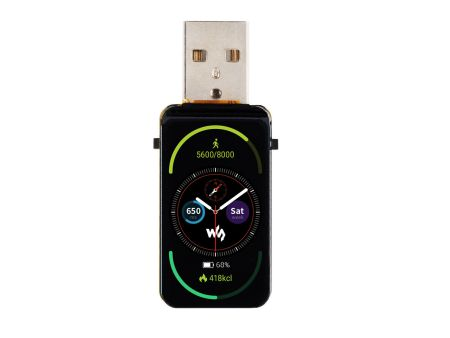
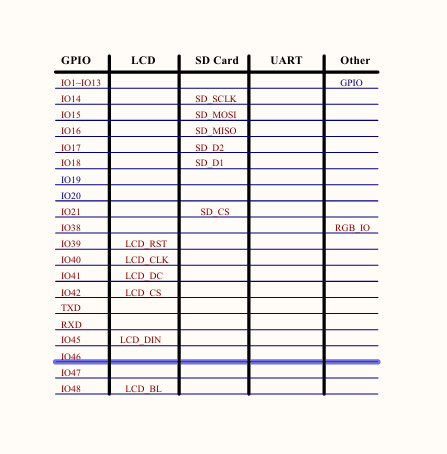

## Es geht um diese Hardware

      

Die Doku des Herstellers findet ihr unter diesem Link.

https://www.waveshare.com/wiki/ESP32-S3-LCD-1.47

Auf dieser Seite wird gezeigt wie mam auf einfache weise das Display ansteuern kann.

https://github.com/dquadros/demos_curtos/blob/main/ESP32C6_LCD_147/Demo/Demo.ino

Da ich einen ESP32-S3-LCD-1.47 nutze, werden andere PIN's für die Display-Ansteuerug verwendet!

Über das Display gibt es nur eine verkürzte Zeitanzeige.
Über den COM-Port gibt es eine Vollständige Ausgabe. 

Jahr-Monat-Tag-Stunde-Minute-Sekunde

Auf einem Windows-Rechner wird ein Proramm gestartet, welches die Uhrzeit stellt.
Dieser Rechner ist nicht im Internet.
